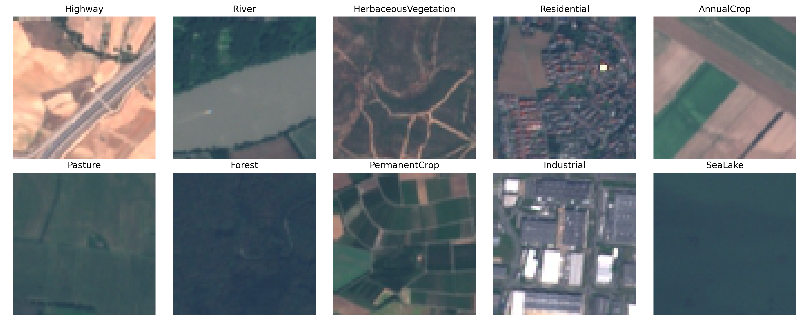
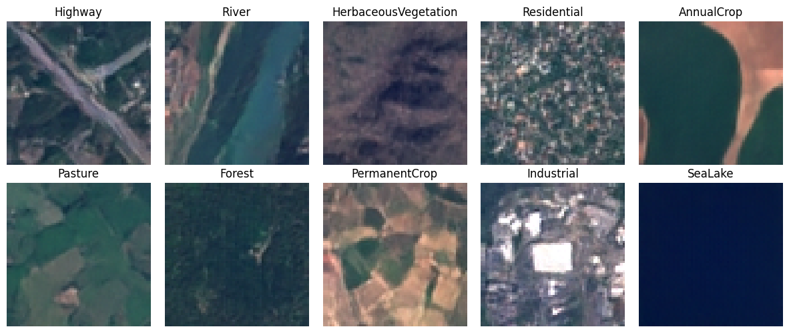
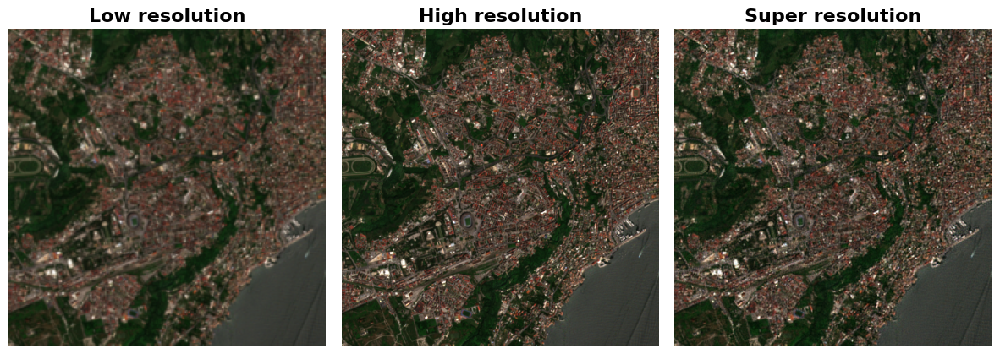
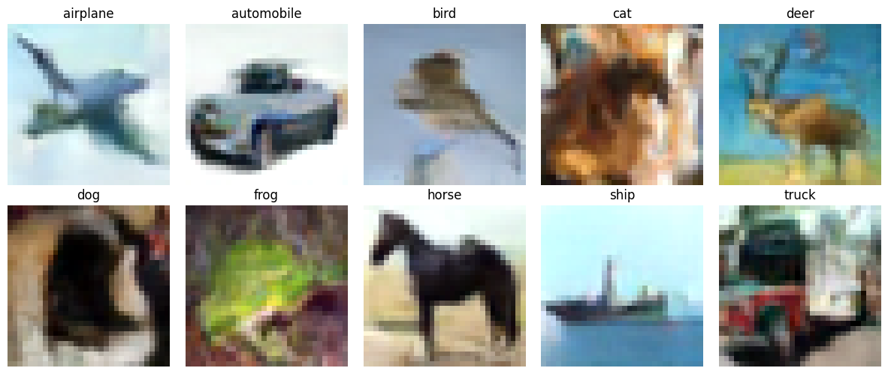

## Exploiting Diffusion Models for Image Super-Resolution and New Image Generation.

### Summary of the files 
In this repo you will find a diffusion model algorithm that can perform both super resolution and new image generation. The repo is called pansharpening because its last aim is to perform Pansharpening (i.e. is a method to improve the multispectral image, that are images with high resolution and few channels, resolution using panchromatic images which have less channels but higher resolution).  In **train_diffusion_superres_COMPLETE.py** there is the diffusion model class with all the functions to perform its sampling and its training. The **UNet_model_superres.py** is the python file of the UNet model used by the diffusion model to get the noise inside the images. 

**train_diffusion_SAR_TO_NDVI_COMPLETE.py** and **UNet_model_SAR_TO_NDVI.py** are exactly the same files but they are used to solve the SAR to NDVI problem. It has been resolved in the same fashion of the super-resolution (instead of using the low resolution input image, we use the SAR image and instead of the high resolution image we use the NDVI image).

Regarding the generative part, there are the training and sampling file and the UNet model file in the folder **generate_new_imgs**. In the generative case there is no function to organize the dataset. You should have a datafolder with inside a folder for each class and inside each classfolder just the images.

In **utils.py** there are the functions used to create the dataset for the super resolution task (data_organizer()) and also the get_data functions which create the dataset that will be input to the dataloader. The **models_representation.pptx** is a power point file in which you can find a representation of the UNet model architectures. **Aggregation_Sampling.py** is used after training to split an image into multiple patches, super resolve each patch and eventually gather the super resolved patches together in the Aggregation Sampling way explained in the paper https://arxiv.org/abs/2305.07015. In **model_tester.py** there is a function to perform the super resolution comparison between different models.

In the **models_run** folder there are the different models with their weights and some results relative to the dataset they are trained on. 

🚧🚧🚧🚧🚧  WORK IN PROGRESS 🚧🚧🚧🚧🚧

In **degradation_from_BSRGAN.py** there are functions taken from https://github.com/IceClear/StableSR to degrade the images in a more realistic way; these functions are then applied in the function get_data_superres_BSRGAN() of utils.py.  In the folder **multihead_attention** there are files to implement the multihead attention mechanism in the UNet model instead of the simple attention.

### Examples
The following are examples of super resolution of our model.

[](https://imgsli.com/MjYyODA2) [](https://imgsli.com/MjYzNzEy) 

The following are examples of image generation vs real of the famous dataset https://github.com/phelber/EuroSAT. The first set of images is the real one and the second set is the generated one.




Let's see some examples of super-resolution of a Sentinel-2 dataset. 

### Video Denoising Results
Here is a video showcasing the denoising results using our model on the Sentinel-2 dataset:


Next, we have some generations of the famous CIFAR10 dataset


### TODO
- [ ] Add MultiHead Attention from Vision Transformer 
- [ ] Incorporate the Diffusion Model in a Latent Diffusion Model
- [ ] Substitute the simple Blur-Down-Gauss degradation with the BSR-degradation algorithm
- [x] ~~Improve the Aggregation Sampling (it is not working properly)~~
- [ ] The EMA model in train_diffusion_generation_COMPLETE.py doesn't work properly. It is a minor problem because in general the results with EMA are not different from the ones without it.
- [x] ~~Add Aggregation Sampling~~

### Train (snippet to train a super resolution model on the anime dataset)
```
python3 train_diffusion_superres_COMPLETE.py --epochs=501 --noise_schedule='cosine' --batch_size=64 --image_size=512 --lr=2e-4 --snapshot_name=snapshot.pt --model_name='DDP_Residual_Attention_UNet_superres_EMA_magnification4_ANIME50k_DownBlur' --noise_steps=1500 --dataset_path='anime_data_50k' --inp_out_channels=3 --loss=MSE --magnification_factor=4 --UNet_type='Residual Attention UNet' --Degradation_type='DownBlur' --multiple_gpus='False' --ema_smoothing='True' --Blur_radius=0.5
```
### Contact
If you have any questions, feel free to contact me at `adriano.ettari@unina.it`

