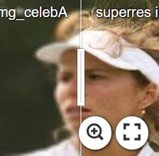
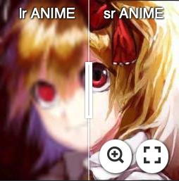

## Exploiting Diffusion Models for Image Super-Resolution and New Image Generation.

### Summary of the files 
In this repo you will find a diffusion model algorithm that can perform both super resolution and new image generation. In **train_diffusion_superres_COMPLETE.py** there is the diffusion model class with all the functions to perform its sampling and its training. The **UNet_model_superres.py** is the python file of the UNet model used by the diffusion model to get the noise inside the images. In **utils.py** there are the functions used to create the dataset for the super resolution task (data_organizer()) and also the get_data functions whose output is given to the dataloader. The **models_representation.pptx** is a power point file in which you can find a representation of the UNet model architectures. **Aggregation_Sampling.py** is used after training to split an image into multiple patches, super resolve each patch and eventually gather the super resolved patches together in the Aggregation Sampling way explained in the paper https://arxiv.org/abs/2305.07015. 

Regarding the generative part, there are the training and sampling file and the UNet model file in the folder **generate_new_imgs**. In the generative case there is no function to organize the dataset. You should have a datafolder with inside a folder for each class and inside each classfolder just the images.

In the **models_run** folder there are the different models with their weights and some results relative to the dataset they are trained on. 

### Examples
The following are examples of super resolution of our model.

[](https://imgsli.com/MjYyODA2) [](https://imgsli.com/MjYzNzEy) 


### TODO
- [ ] Add MultiHead Attention from Vision Transformer 
- [ ] Incorporate the Diffusion Model in a Latent Diffusion Model
- [ ] Substitute the simple Blur-Down-Gauss degradation with the BSR-degradation algorithm
- [ ] Improve the Aggregation Sampling (it is not working properly)
- [x] ~~Add Aggregation Sampling~~

### Train
```
python3 train_diffusion_superres_COMPLETE.py --epochs=200 --noise_schedule='cosine' --batch_size=32 --image_size=256 --lr=2e-4 --snapshot_name=snapshot.pt --model_name='UNet_Faces_superres_TO_REMOVE' --noise_steps=1500 --dataset_path='anime_data_50k' --inp_out_channels=3 --loss=MSE --magnification_factor=4 --UNet_type='Residual Attention UNet' --Degradation_type='DownBlur' --multiple_gpus='False' --ema_smoothing='True'
```
### Contact
If you have any questions, feel free to contact me at `adriano.ettari@unina.it`

